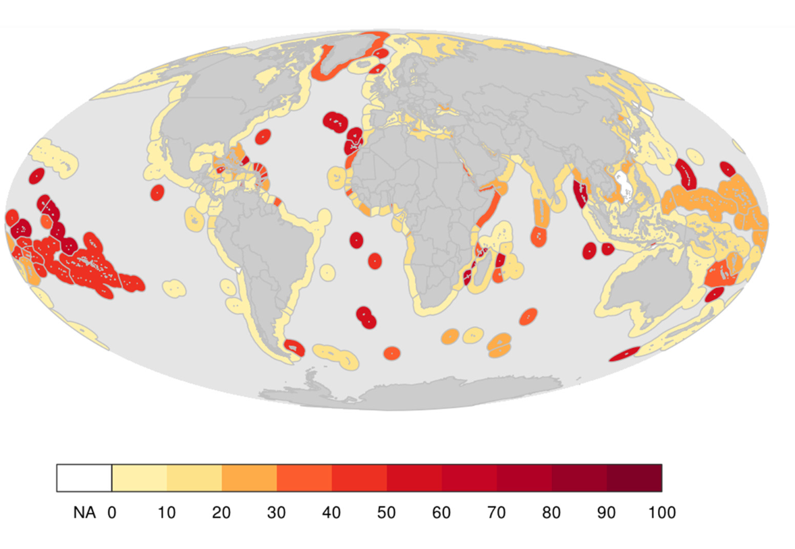
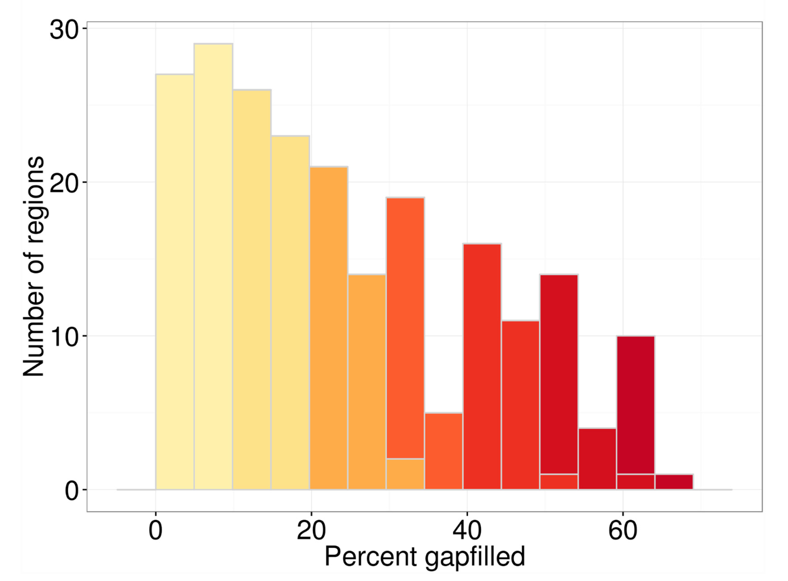

# Data and Goal Models: Global {#data-goal-models} 

```{r explore, include=FALSE}
knitr::opts_chunk$set(echo = TRUE)
library(htmltools)
```

## Objectives and Resources

What data are included to calculate scores for global assessments? There are actually many levels to answering this. There are over 100 data sources that are used to calculate global assessments, and these are the data we most easily report. However, the data available for each of the 220 countries and territories varies within these data sources. Here we will begin to explore those data.

**Objectives**

- explore goal models and data sources for global assessments
- discuss gapfilling data in global assessments

**Resources**

- http://ohi-science.org/ohi-global/layers_table.html
- (Mapping Uncertainty Due to Missing Data)[http://journals.plos.org/plosone/article?id=10.1371%2Fjournal.pone.0160377)

----


## Goal Models and Data Sources

More information on each goal in the global assessment: [ohi-science.org/ohi-global/goals](http://ohi-science.org/ohi-global/goals.html)


We will focus on a few goals that we will then explore deeper for your country. For example:

- Tourism & Recreation
- Habitats
- Fisheries
- Iconic Species


## Gapfilling Data: Global Assessments

### Methods 
- For priority setting
- Intro of gapfilling
    - Mel's paper (not LE)
    - Mel's presentation

### Results
The results for 220 countries in 2015. From Frazier et al: 

> Regions varied greatly in the contribution of gapfilled data to their overall index scores. Regions with larger amounts of gapfilled data tended to be smaller and/or territorial jurisdictions of countries, highlighting the fact that most territories and smaller countries (often with smaller economies and other resources) tend to be monitored and assessed less frequently. 


*Figure 2a*
<br>

> For the regions, the contribution of gapfilled data to their index scores ranged from 0 to 64%. For many regions, index scores were calculated using relatively little gapfilled data: 27 regions (of 220) had 5% gapfilled data, and 56 regions had 10%. ... In general, the contribution of gapfilled data to index scores was fairly high for Islands in the South Pacific.


*Figure 2b*

<br>

This plot is meant to show an overall picture of gapfilling in global assessments. Each row is a different country, and each column is a different goal. In these plots, reds mean the highest amounts of gapfilling, yellows are the least, and grey means not applicable. 


