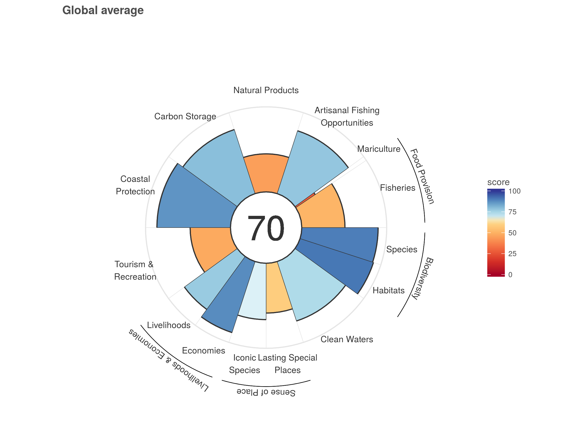

# OHI Framework: Global {#framework} 

```{r setup, include=FALSE}
knitr::opts_chunk$set(echo = TRUE, message=FALSE, warning=FALSE)
library(htmltools)
```

## Objectives and Resources

This chapter will focus on the conceptual framework of the Ocean Health Index. We will interpret the goals assessed and the scores for the global assessments, and discuss whether all the goals are relevant for the specific country. 


**Objectives**

<!---
There will be a presentation covering the following: 

- What the OHI framework is, and why it is important
- The OHI repeatable assessment process
- The OHI Program "Umbrella": 
    - OHI global assessments, repeated annually since 2012
    - OHI+ <!---3 tiers: country opportunities, tailor global, tailor OHI+
    - Science, data science, and open science
    - Community of practice
- Support materials on ohi-science.org

--->

**Resources**

The Ocean Health Index has two main websites – [oceanhealthindex.org](http://www.oceanhealthindex.org) and [ohi-science.org](http://ohi-science.org/) – each with their own purpose. As a general rule of thumb, [oceanhealthindex.org](http://www.oceanhealthindex.org) gives an overview of OHI, while [ohi-science.org](http://ohi-science.org/) provides a technical perspective of OHI and insights into the open data science that supports the creation of OHI scores.

- http://ohi-science.org/
- http://www.oceanhealthindex.org


- http://www.oceanhealthindex.org/methodology/goals
- http://ohi-science.org/goals/
- http://www.oceanhealthindex.org/region-scores

You start with the philosophy of the goal, and think about the ideal data and model. You then look for existing data to use, and will likely have to modify the model to accommodate the best available data. Lowndes et al 2015.

<!---
## Ocean Health Index Program Overview

[link to a shortened version of this presentation](https://docs.google.com/presentation/d/1kpKiCrdLHFwgysgskFzei8RaAfgS2rNg_cypS54JOkg/edit#slide=id.g390ee9ea07_0_0)

--->

<!---https://docs.google.com/presentation/d/1CVK8HRDubFU4UEduBK5q6JJebhbyVjB6SpTpjZI6q6Y/edit#slide=id.g215a57b666_0_490
 --->

<!---

--->

<!--- 
## Countries and Territories Assessed 

Global OHI assessments score 220 coastal countries and territories. 

The best place to get a sense of the countries assessed in global OHI assessments is exploring interactively at [oceanhealthindex.org/region-scores](http://www.oceanhealthindex.org/region-scores/).


--->

## Interpreting scores

All reported scores are between 0-100, with 0 being the lowest and 100 being the highest. 

OHI scores represent how well coastal nations and territories deliver a suite of ocean-derived benefits to humans, on a scale of 0-100. Scores are represented in flower plots, where each petal represents an OHI goal or sub-goal. The center number is the region’s overall Index score.

Let's have a look at the Global average for 2017:



The petal length and color convey the score of the goal, where longer, dark blue petals are closer to achieving their target. The width of the petals represents their weighting, where all goals are equally weighted but sub-goals vary.

Now that we know all the flower plot components, what insights can we gain? Here the Index score is 70/100, highlighting room for improvement to achieve a healthy, sustainably managed ocean. Species & habitats scored the highest, and mariculture & fisheries scored the lowest.


## Goals Assessed

**Global Ocean Health Index assessments score 10 goals, some of which have sub-goals**. 

The Ocean Health Index measures the ability of oceans to sustainably provide 10 products or services (called "goals") that are important to humans. Here you will find a description of the goals used in global assessments. Goal-by-goal, you can explore the data used to model status and trend, as well as the pressures and resilience measures contributing to goal scores.     


## Goal Philosophies

presentation

## Discussion: Are all goals relevant?

Let's start off by looking at which goals are scored for your country. Go to [oceanhealthindex.org/region-scores](http://www.oceanhealthindex.org/region-scores) and type in your country of interest, for example: [Samoa](http://www.oceanhealthindex.org/region-scores/scores/samoa).

Are any goals not assessed (showing up as a grey petal because there was no score calculated ["NA"])

Another way to look at this is on [ohi-science.org/ohi-global](http://ohi-science.org/ohi-global): this is a slightly different display because it shows the sub-goals of each goal as separate petals instead of combined. 


## Calculating scores

**Goal scores are calculated by modeling data first as Present Status and Likely Future State.**  

Likely Future State is a combination of status, trend, pressures and resilience calculations, which unequally contribute to goal scores.  


### Reference points

Reference points exist

<!---
### Pressures and Resilience

measures exist


## Discussion: Are all resilience measures relevant for your country?

--->


